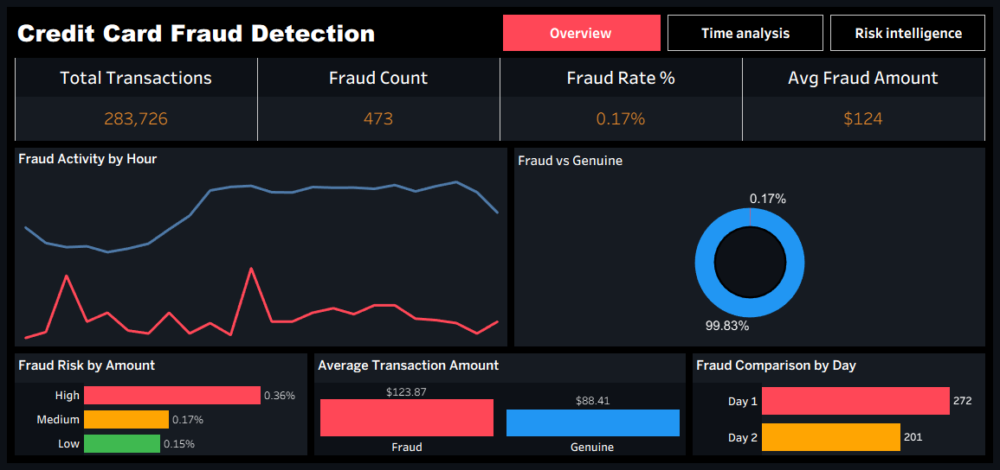

###  Credit Card Fraud Detection
## SQL + Python + Tableau End-to-End Analytics Project



## Project Overview

Credit card fraud is a major challenge for financial institutions, causing financial losses, operational inefficiencies, and customer trust issues. This project demonstrates an end-to-end analytics solution designed to identify fraud patterns, analyze transaction behavior, measure fraud exposure, and deliver actionable business insights through an interactive Tableau dashboard.

The project integrates:

- **Python** for data cleaning and feature engineering
- **SQL** for business analysis and fraud investigation
- **Tableau** for dashboard development and executive reporting

The goal is not only to visualize fraudulent transactions but also to answer critical business questions that support fraud monitoring, risk assessment, and data-driven decision-making.

---

# Business Problem

Financial institutions process thousands of transactions daily. Detecting fraudulent activity quickly and accurately is essential to minimizing financial losses and improving operational efficiency.

### Key Challenges

- Detect suspicious transaction behavior
- Identify high-risk transaction periods
- Understand fraud distribution patterns
- Measure fraud exposure across risk levels
- Monitor fraud activity throughout the day
- Support fraud investigation teams

### Business Risks Without Analytics

- Missed high-risk transactions
- Increased fraud losses
- Slower investigation processes
- Poor decision-making due to limited visibility

This project transforms raw transaction data into meaningful business intelligence that supports fraud detection and risk management.

---

# Dataset Information

| Metric | Value |
|----------|----------|
| Total Transactions | 284,807 |
| Fraudulent Transactions | 492 |
| Legitimate Transactions | 284,315 |
| Fraud Rate | ~0.17% |

### Dataset Features

- Transaction Amount
- Transaction Time
- Fraud Indicator
- Risk Categories
- Time-Based Features
- Fraud Exposure Metrics

---

# Project Architecture

```text
Raw Dataset
      │
      ▼
Python Data Cleaning
      │
      ▼
Feature Engineering
      │
      ▼
SQL Business Analysis
      │
      ▼
Business Metrics Generation
      │
      ▼
Tableau Dashboard Development
      │
      ▼
Interactive Executive Reporting
````

---

# Tools & Technologies

## Python

Used for:

* Data Cleaning
* Data Validation
* Feature Engineering
* Data Transformation
* Risk Classification

### Libraries

* Pandas
* NumPy

---

## SQL

Used for:

* Fraud Analysis
* Business Queries
* Aggregations
* Ranking Analysis
* Time-Based Analysis
* Window Functions

### SQL Concepts Applied

* CASE WHEN
* GROUP BY
* ORDER BY
* HAVING
* Common Table Expressions (CTE)
* Window Functions
* RANK()
* DENSE_RANK()
* SUM()
* AVG()
* COUNT()
* Conditional Aggregation

---

## Tableau

Used for:

* Dashboard Development
* KPI Monitoring
* Interactive Navigation
* Executive Reporting
* Data Storytelling

---

# Data Preparation & Feature Engineering

Several business-focused features were created to improve fraud analysis.

## Fraud Count

Measures the total number of fraudulent transactions.

## Fraud Rate

Calculates the percentage of fraudulent transactions relative to total transactions.

## Average Fraud Amount

Measures the average value of fraudulent transactions.

## Fraud Exposure

Represents financial risk exposure based on transaction amounts.

## Risk Flag

Transactions were categorized into:

* Critical
* High
* Medium

## Shift Classification

Transactions were grouped into:

* Morning
* Afternoon
* Evening
* Night

This enables detailed time-based fraud analysis.

---

# Business Questions Solved

## Q1. What is the overall fraud rate?

**Business Value:**
Provides a high-level understanding of fraud risk across all transactions.

---

## Q2. How many fraudulent transactions occurred?

**Business Value:**
Measures fraud volume and investigation workload.

---

## Q3. What is the average fraud transaction amount?

**Business Value:**
Estimates the average financial impact of fraud incidents.

---

## Q4. Which hours experience the highest fraud activity?

**Business Value:**
Supports staffing and fraud monitoring schedules.

**Finding:**
Fraud activity is concentrated during late-night hours.

---

## Q5. Which shift carries the highest fraud exposure?

**Business Value:**
Identifies operational risk windows.

**Finding:**
Night Shift shows the highest fraud exposure.

---

## Q6. How does fraud compare with genuine transactions?

**Business Value:**
Provides context regarding fraud frequency relative to legitimate activity.

---

## Q7. Which risk category contributes the most exposure?

**Business Value:**
Helps prioritize fraud investigations.

**Finding:**
Critical and High-Risk transactions contribute the majority of fraud exposure.

---

## Q8. How does fraud vary across days?

**Business Value:**
Identifies transaction trends and operational patterns.

---

## Q9. What are the top high-value fraudulent transactions?

**Business Value:**
Supports fraud investigation and case review.

---

## Q10. How does fraud accumulate throughout the day?

**Business Value:**
Reveals fraud velocity and concentration periods.

**Finding:**
Fraud activity increases significantly during specific time windows.

---

# Dashboard Pages

## Page 1 – Executive Overview

Provides a high-level summary of fraud performance.

### KPIs

* Total Transactions
* Fraud Count
* Fraud Rate %
* Average Fraud Amount

### Visualizations

* Fraud Activity by Hour
* Fraud vs Genuine Distribution
* Fraud Risk by Amount
* Average Transaction Amount
* Fraud Comparison by Day

### Business Purpose

Enable executives and stakeholders to quickly assess fraud performance.

---

## Page 2 – Time Analysis

Focuses on transaction timing and fraud concentration.

### Visualizations

* Hourly Fraud Heatmap
* Fraud Velocity Running Total
* Shift-Based Analysis
* Peak Fraud Window
* Safest Transaction Window

### Key Insight

Fraud activity peaks during late-night hours.

### Business Purpose

Support operational planning and fraud monitoring schedules.

---

## Page 3 – Risk Intelligence

Focuses on fraud exposure and risk prioritization.

### Visualizations

* Risk Flag Treemap
* Amount Percentile Analysis
* Fraud Exposure by Risk Category
* High-Risk Insights
* Business Recommendation Cards

### Key Insight

High-risk transactions contribute disproportionately to overall fraud exposure.

### Business Purpose

Support fraud investigation and risk management strategies.

---

# Key Business Insights

### Fraud Rate Is Low but Financial Impact Is Significant

Although fraudulent transactions represent a small percentage of total transactions, they create substantial financial risk.

### Night Hours Require Increased Monitoring

Fraud activity is heavily concentrated during nighttime periods.

### High-Value Transactions Require Priority Investigation

Large transactions contribute significantly to fraud exposure.

### Risk Segmentation Improves Investigation Efficiency

Categorizing transactions into Critical, High, and Medium risk levels enables targeted fraud management.

### Interactive Dashboards Improve Decision-Making

Business users can explore fraud trends and insights without writing SQL queries.

---

# Tableau Features Implemented

* Interactive Navigation Buttons
* Multi-Page Dashboard Design
* Dynamic KPI Cards
* Custom Color Themes
* Dashboard Actions
* Interactive Filtering
* Executive Storytelling Layout
* Risk-Based Visual Analytics

---

# Business Impact

This solution demonstrates how analytics can help organizations:

* Reduce fraud investigation time
* Identify high-risk transaction patterns
* Improve monitoring efficiency
* Support data-driven fraud management
* Enhance operational decision-making

The dashboard converts raw transaction records into actionable business intelligence for fraud analysts, investigators, risk managers, and decision-makers.

---

# Skills Demonstrated

## Data Analytics

* Data Cleaning
* Data Transformation
* Feature Engineering
* Exploratory Data Analysis (EDA)

## SQL

* Business Problem Solving
* Window Functions
* Ranking Analysis
* Aggregation Techniques
* Fraud Analytics

## Tableau

* Dashboard Design
* KPI Development
* Interactive Reporting
* Data Storytelling
* Business Intelligence

## Business Analysis

* Risk Assessment
* Fraud Monitoring
* Performance Measurement
* Operational Insights

---

# Project Outcome

Successfully developed a complete end-to-end fraud analytics solution using Python, SQL, and Tableau.

The project transforms over **284,000 financial transactions** into actionable business insights, enabling stakeholders to understand fraud behavior, monitor risk exposure, identify high-risk patterns, and make informed decisions through interactive business intelligence dashboards.


```
```
